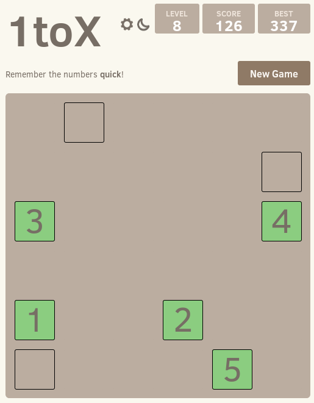

# 1toX
Simple memorizer game to see how quick your brain works.
The code is to build an android app. For the browser version, see [og8.org/1toX](https://og8.org/1toX).

### Contributions
The basic design came from the 2048 game from Gabriele Cirulli.

### Screenshot

## Contributing
Changes and improvements are more than welcome! Feel free to fork and open a pull request. Lets discuss new ideas and feutures.

## License
The code is free. Do whatever you want with it. 
1toX is licensed under the MIT license.

