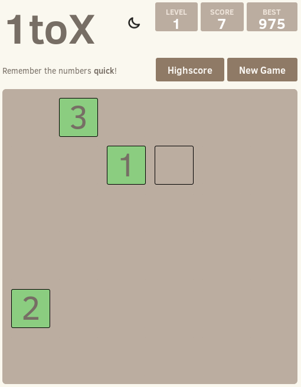

# 1toX
Super simple memorizer game to see how quick your brain works.

### Contributions
The basic design came from the 2048 game from Gabriele Cirulli.

### Screenshot

## Contributing
Changes and improvements are more than welcome! Feel free to fork and open a pull request. Lets discuss new ideas and feutures.

## License
The code is free. Do whatever you want with it.
1toX is licensed under the MIT license.

